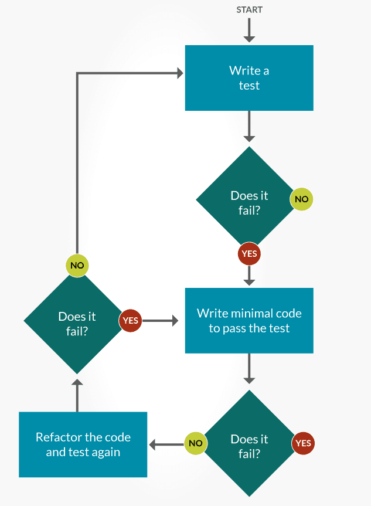
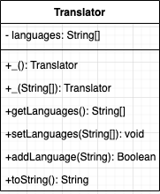

# Project 1 TDD

## What is TDD

“Test-driven development” refers to a style of programming in which three activities are tightly interwoven: coding, testing (in the form of writing unit tests) and design ( in the form of refactoring)

**Refactoring** -  the process of restructuring computer code without changing or adding to its external behavior and functionality.

**Unit Test** -  the smallest piece of code that can be logically isolated in a system. In most programming languages, that’s a function, sub-routine or method.

## The TDD Process
* Write a test
* Run a test and see if it fails (Yay Failure!!)
* Write code
* Run the tests again (Hopefully it passes)
* Rewrite / Refactor code to make it more efficient
* Run Test again to make sure you didn’t break anything.

## UML

UML - short for Unified Modeling Language, is a standardized modeling language consisting of an integrated set of diagrams, developed to help system and software developers for specifying, visualizing, constructing, and documenting the artifacts of software systems, as well as for business modeling and other non-software systems.

### Types of UML

* Class 
* Component
* Deployment
* Object
* Package
* Sequence

We will be focusing on Class diagrams. Before you write any code to truly master the art of TDD, you must have a plan. Once you have your requirements, the next step is to model out your solution. This is done via UML Class Diagrams.

| Symbol | Meaning |
| :------: | :-------: |
|  | Default |
| +       | Public |
| - | Private |
| #| Protected |
| _ | Constructor |
| < > | Interface |

## Example

In the the `projects.tdd_example` package we have a class called `Translator`.

Below is the UML Diagram for the `Translator` class, we are going to complete the class using the UML.

## Overview 

We have all come across ATMs in our cities and it is built on Java. This complex project consists of five different classes and is a console-based application. 

When the system starts the user is prompted with user id and user pin. On entering the details successfully, then ATM functionalities are unlocked. 

The project allows to perform following operations:

1. Transactions History
2. Withdraw
3. Deposit
4. Transfer
5. Quit

## Step 01

In the `docs` folder there are two files :

* project01SPD.docx
* PropsAndBehaviorsTable.docx

Use these two documents to create a plan for your application. Once this is completed, and you have instructor approve it.

After you have had your documents approved, create your UML document. Once this is approved, you can start coding using the TDD process.
